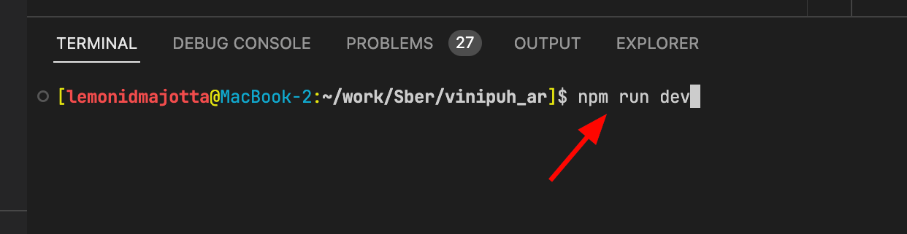

# vinipuh_ar

## Подготовка

Рекомендую использовать Visual Studio Code [скачать](https://code.visualstudio.com/) для удобства
Так же скачать плагин дя [Svelte](https://marketplace.visualstudio.com/items?itemName=svelte.svelte-vscode)

1. ### Установить Node.js версии 16.16.0 [скачать](https://nodejs.org/en/blog/release/v16.16.0)

    

2. ### Установить зависимости проекта

    - Откройте папку с проектом в Visual Studio Code
      
    - Откройте терминале(консоле) в текущий папки проекта, зажмите `Ctrl+J`
      
    - Установите зависимости проекта в терминале введите команду `npm install`
      
    - После установки введите команду `npm run dev`
      
    - Если всё прошло успешно то в терминале появится ссылки. При переходе на которую откроется страница с дев версией сайта
      

## Работа

Для распознавания/трекинга картинки а так размещение в пространстве сцены используется библиотека [MindAR](https://hiukim.github.io/mind-ar-js-doc/) [github](https://github.com/hiukim/mind-ar-js). Для рендеринга 3d используется библиотека [three.js](https://threejs.org/) [github](https://github.com/mrdoob/three.js/)

1. ### Изменить изображения к которому будет прикрепляться 3d сцена

    - Изображение нужно преобразовать в специальный формат `.mind` Это можно сделать с помощью этого [сайта](https://hiukim.github.io/mind-ar-js-doc/tools/compile).
    - На проекте изображения находятся в папке `public/`
      
    - Можно заменить текущий с тем же именем или создать новый. В коде путь к файлу `.mind` находится в файле [App.svelte](./src/App.svelte) на строке 17. Если хотим заменить изображения для отслеживания то просто закидываем новый фаил в папку `public` и в в файле [App.svelte](./src/App.svelte) меняем старое название на новое.
      

2. ### Изменения 3d модели

    - Модель должны быть экспортированная в формате `.glb` или `.gltf`
    - Модели в проекте находятся в папке `src/gltf/`
      
    - Проще всего наверное будет заменять старую модель на новую. В файле [App.svelte](./src/App.svelte) настройки модели начинаются с 31 строки. `playerMash.scale.set(x, y, z)` меняет размер модели, `playerMash.position.set(x, y, z)` позволяет сделать смещение по координатам относительно центра сцены, `playerMash.rotation.set(x, y, z)` поворот модели.
      

3. ### Сборка проекта
    - После того как всё настроена нужно собрать проект. В терминале введите команду `npm run build`
    - После выполнения сборки появится папка `dist/` Содержимое этой папке можно заливать на сервер как обычный сайт.
      
